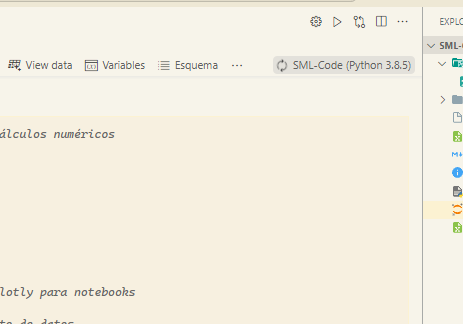

# Creando un entorno para este caso de uso

## Crear el env

```bash
python -m venv SML-Code
```

## Activar el env

```bash
.\SML-Code\Scripts\activate
```

## Instalacion de dependencias

```bash
pip install -r requirements.txt 
```

## Seleccionar el environment


